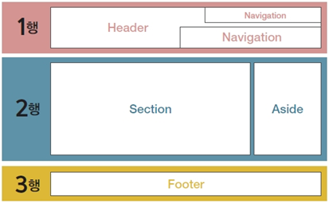
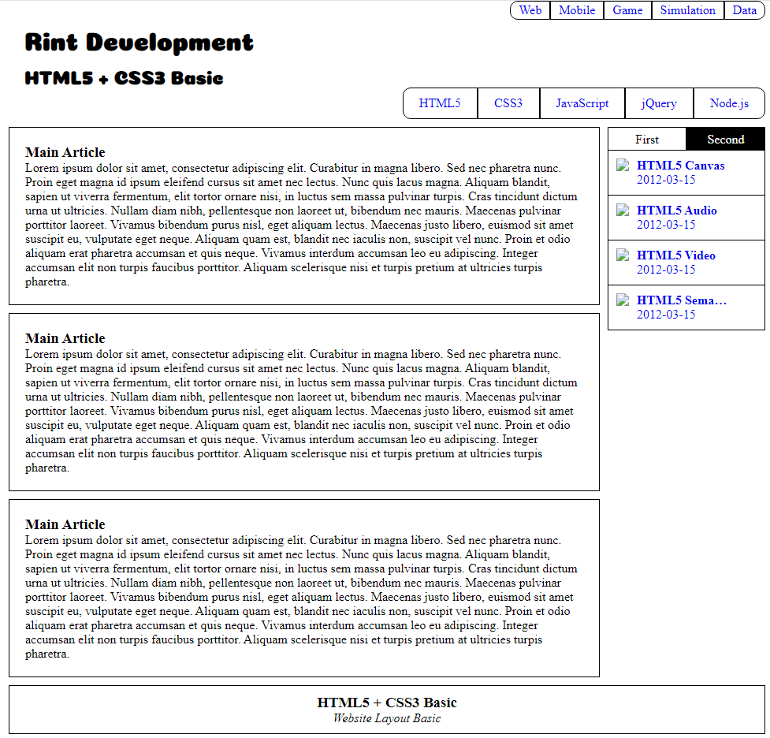

    <h2>
        공간 분할 순서
    </h2>
    

    	
    

    <ol>
        <li>웹 페이지를 구상</li>
        <li>웹 페이지의 구성 영역을 분리</li>
        <li>구성 영역을 행 단위로 분리</li>
        <li>나누어진 행의 내부 요소를 분리</li>
    </ol>
    

	

